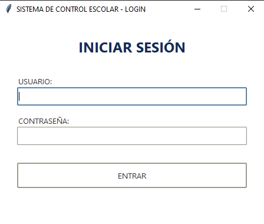
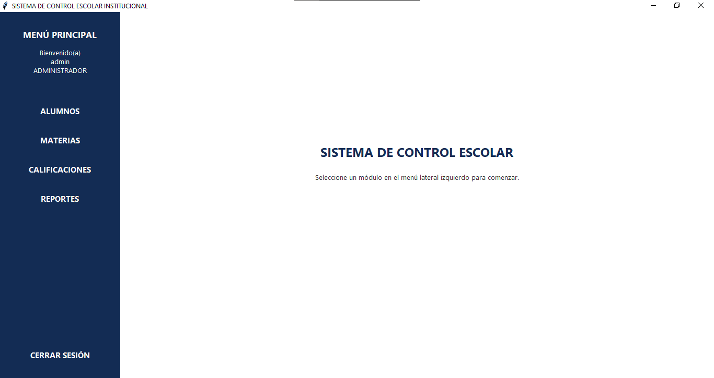

# Sistema de Control Escolar Madero
**Opción:** 3
**Desarrollador:** [Hernandez Silva Jorge Emilio]

## Descripción
El **Sistema de Control Escolar Madero** es una aplicación de escritorio diseñada para resolver los problemas de gestión administrativa en instituciones educativas. Está dirigida a personal administrativo y profesores que necesitan una herramienta centralizada, moderna y segura para administrar el registro de alumnos, el catálogo de materias y el historial de calificaciones.

## Requisitos
Para ejecutar este proyecto, es estrictamente necesario contar con:
* **Python 3.10+** (o superior)
* **Tkinter** (Viene incluido por defecto en las instalaciones estándar de Python)
* **SQLite 3** (Librería estándar de Python, no requiere instalación)
* **hashlib** (Librería estándar de Python para cifrado de contraseñas)

## Instalación y ejecución
Sigue estos comandos paso a paso para desplegar el proyecto en tu entorno local:

1. **Clonar el repositorio:**
   ```bash
   git clone https://github.com/tu-usuario/tu-repositorio.git
   cd tu-repositorio
   ```

2. **Crear y activar un entorno virtual (Recomendado):**
   ```bash
   # En Windows (PowerShell/CMD)
   python -m venv .venv
   .venv\Scripts\activate
   
   # En macOS/Linux
   python3 -m venv .venv
   source .venv/bin/activate
   ```

3. **Ejecutar la aplicación:**
   *(Como la arquitectura se basa enteramente en la librería estándar, no es necesario ejecutar `pip install`)*
   ```bash
   python main.py
   ```

## Usuarios de prueba
El sistema inicializa la base de datos automáticamente en su primer arranque. Usa estas credenciales:
* **Administrador:** 
  * Usuario: `admin`
  * Contraseña: `admin123`
* **Operador:** *(Usuario conceptual con acceso limitado, agregar vía código según el caso)*
  * Usuario: `operador`
  * Contraseña: `operador123`

## Modelo de datos
La base de datos SQLite consta de 4 entidades principales:
* **usuarios_sistema:** Almacena credenciales de acceso. Su columna `password_hash` protege las contraseñas mediante SHA-256.
* **alumnos:** Catálogo de estudiantes con su matrícula, nombre, correo y estado (activo/inactivo).
* **materias:** Catálogo de asignaturas con su clave, nombre y valor en créditos.
* **calificaciones:** Tabla transaccional (Movimientos) que registra el historial cruzando `alumno_id` y `materia_id`.

## Funcionalidades
* **Catálogos (CRUD):** Registro, edición, baja lógica (desactivar) y baja física (eliminar con `DELETE`) de Alumnos y Materias.
* **Reglas de Integridad:** Bloqueo del sistema al intentar eliminar o desactivar un alumno/materia que ya cuente con calificaciones registradas en su historial.
* **Movimientos:** Registro de calificaciones con validación estricta de rangos (0 a 100) y validación UNIQUE para impedir que un alumno duplique materia en el mismo periodo.
* **Reportes:** Generación automática de una boleta que filtra y lista a los alumnos reprobados (calificación menor a 70), mostrando la materia reprobada y calculando el promedio general del estudiante.

## Estructura del proyecto
El código respeta fielmente el patrón de separación de responsabilidades (Arquitectura de Capas):
* `ui/`: Vistas de la aplicación, manejo de eventos de Tkinter y estilos visuales. Sin lógica de base de datos.
* `models/`: Clases puras de dominio (`dataclasses`) que representan las entidades sin lógica.
* `repositories/`: Encargados exclusivos de la persistencia de datos y ejecución de sentencias SQL.
* `services/`: Capa de negocio que intercepta validaciones, aplica reglas matemáticas o de integridad y traduce errores de DB hacia la interfaz.

## Capturas






